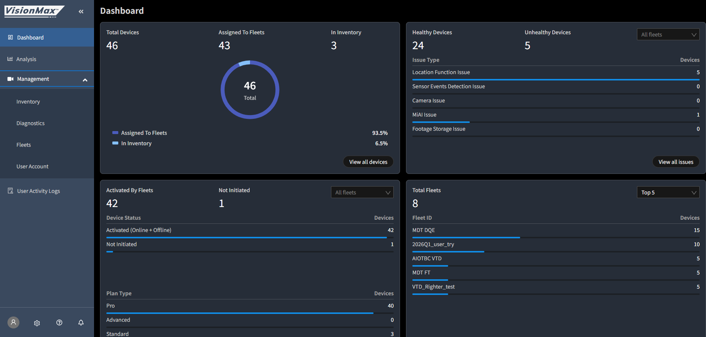
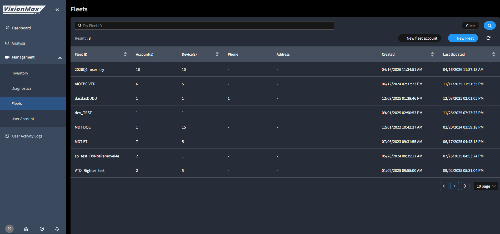
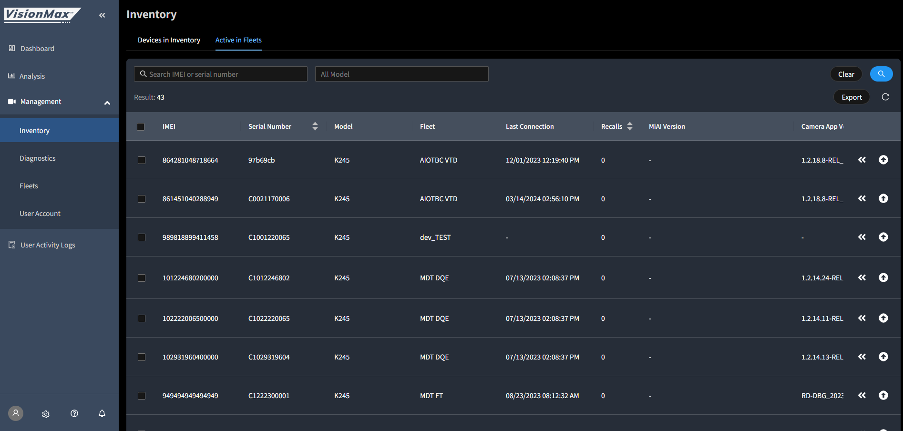
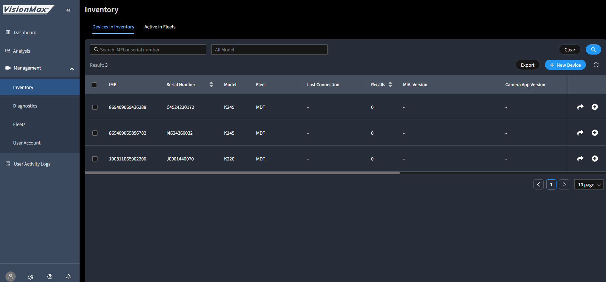
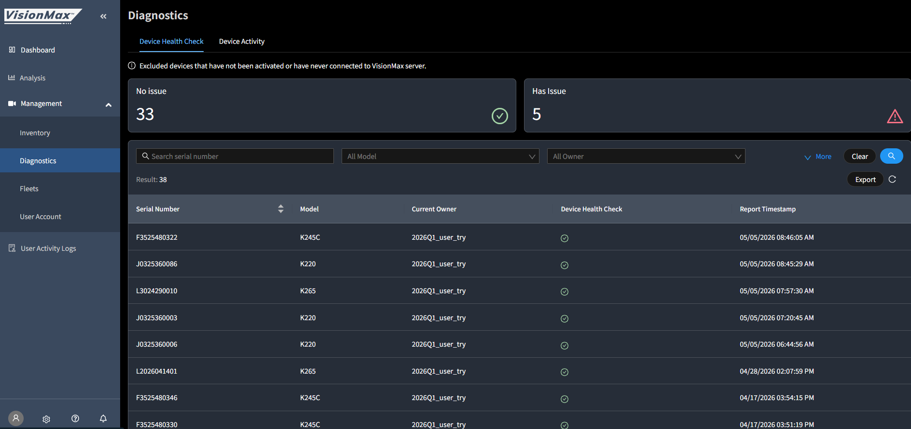
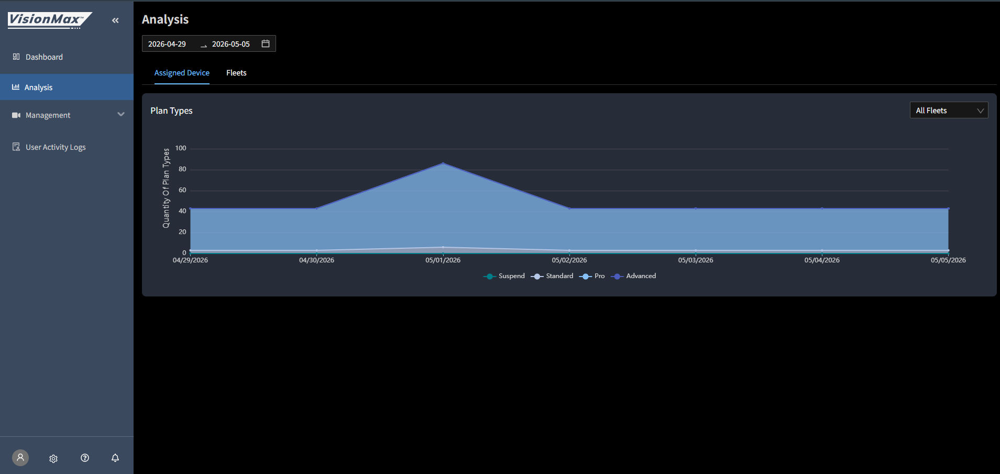
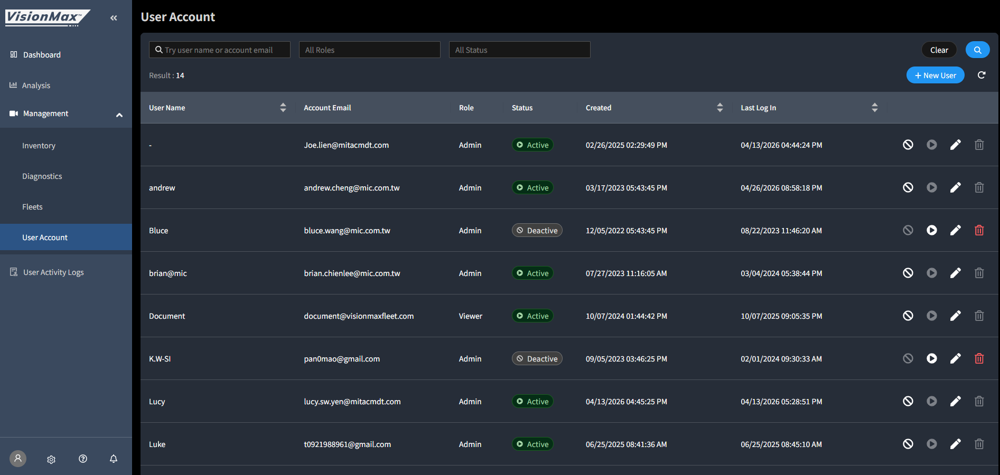
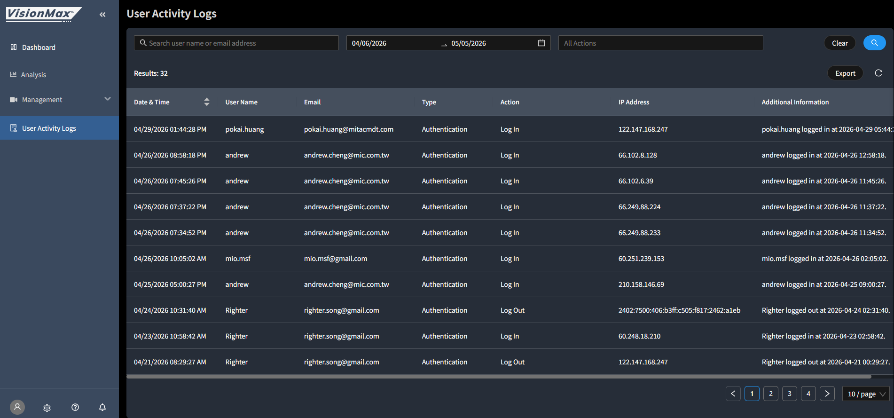

# Master Portal 操作層(memory 之前 0/8 沒覆蓋)

> 來源:KB Master Portal 8 篇文章
> Memory 整理日:2026-05-06
> ⚠️ 各文章內容**沒全部抓**,這份是 catalog + 該文章在 KB 的位置 + 對 PM 的意義

## KB Master Portal 8 篇

| KB 文章 | 對 PM 意義 |
|---------|----------|
| **What can I do in Master portal?** | 對客戶 demo 開場必讀,涵蓋總覽 |
| How do I add a new device to my fleet? | Onboarding SOP |
| **VisionMax Update History & Release Notes** ⭐ | 跟客戶講「最近 release 什麼」必查 |
| How to Change Devices Settings to a Normal Car | 客戶設備 spec 變更 |
| How do I set portal language, time zone, date format? | 海外客戶 first-time setup |
| **How do I update SW for all devices at one time?** | 批量 OTA(對應 #11 Brian OTA 議題) |
| Portal Usage Guides | 完整操作指南 |
| How to Add New Account? | Account 管理(對應 Viewer Only Role 議題) |

## 📸 Master Portal 8 個主要頁面實際截圖

> 從 Kenny 名下測試帳號 K245 (L3024290010) 截圖。對客戶 demo 前先在這裡熟悉 UI 結構。

### Dashboard — 總覽入口

*KPI 儀表板,所有 fleet 健康度總覽,新人最先看的頁面。*

### Fleets — 所有 fleets 列表

*Master Portal 級的 fleet 列表(注意:**只到 main fleet 級**,不顯示 contract fleets — 5/8 sync-up 揭露的關鍵限制)。*

### Active in Fleet — 已分配設備檢視

*查特定 fleet 裡的 active 設備清單。Vinicius 案件 K245 加入 inventory 後在這查得到狀態。*

### Inventory — 設備庫存管理

*設備加入 / 派發 / 移除的中央視圖。Righter Song 5/7 加 F4723090033 進這頁。*

### Diagnostics — 設備健康度

*Issue Type 過濾器 + 設備異常清單。Brian #11 OTA 17 個月議題就是這頁的 backlog 來源。*

### Analysis — 跨 fleet 數據分析

*跨 fleet 的事件 / safety score / 使用率交叉比對。MAU 中央分析入口。*

### User Account — 帳號管理

*Account 增刪改 / 權限分配。**對應 5/6 會議 Viewer Only Role 議題([VMX-7088](https://jira.navman.co.nz/jira/browse/VMX-7088))**。*

### User Activity Logs — 操作稽核

*誰在什麼時候改了什麼。資安 / 合規場景必備。*

---

## 對應到 portal-architecture.md 的 Master Portal 7 頁

| KB 文章 | 對應 portal page | KB Link |
|---------|-----------------|---------|
| What can I do in Master portal | Dashboard 總覽 | 待擴 |
| How do I add a new device | Inventory + Fleets | 待擴 |
| How do I update SW for all devices at one time | Diagnostics(Issue Type 顯示問題機台) | 待擴 |
| How to Add New Account | User Account | 待擴 |
| How to Change Devices Settings to a Normal Car | (跨多頁,可能在 Inventory 內) | 待擴 |
| Portal Usage Guides | (overview 文件) | 待擴 |

## ⚠️ KB 跟 portal-briefing 差異

`../../websiteview/portal-briefing.html` 是 Kenny 整理的 25 張投影片版,**比 KB 詳細**(因為 PDF + 實際盤點)。

但 KB **更新比較快**(VisionMax Update History & Release Notes 是 KB 上專門 Master Portal 文件)。

→ 規則:對客戶 demo 用 presentations/ 內 pptx 投影片;**最新版本對齊看 KB**。

## Action Items

- [ ] 開 KB 把 Master Portal 8 篇全部讀過(下次 deep dive 時)
- [ ] 把 VisionMax Update History 加進每週 routine(看新 release 對應到 sheet 進度)
- [ ] 「How to Add New Account」對應 Viewer Only Role 釐清(2026-05-06 會議議題)
