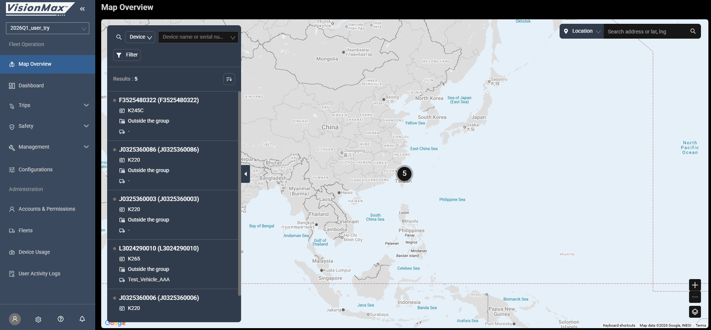
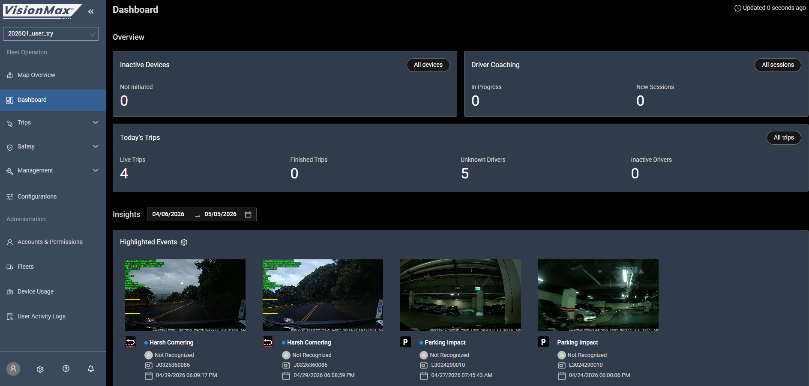
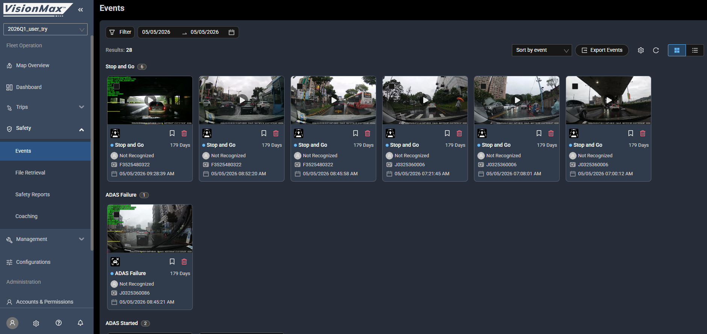
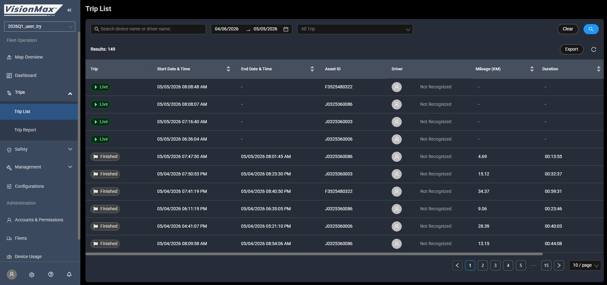
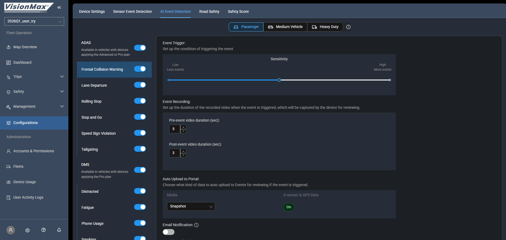
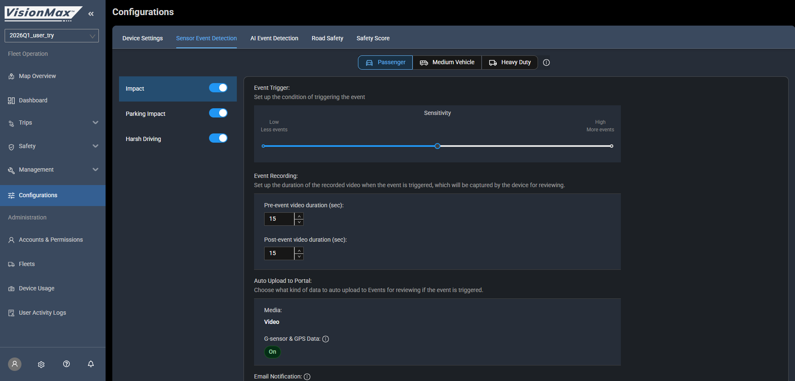
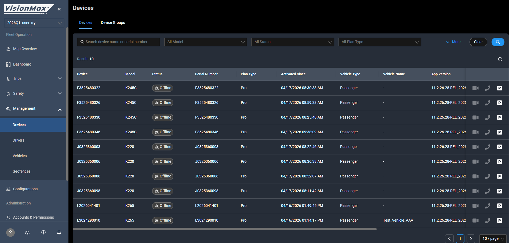
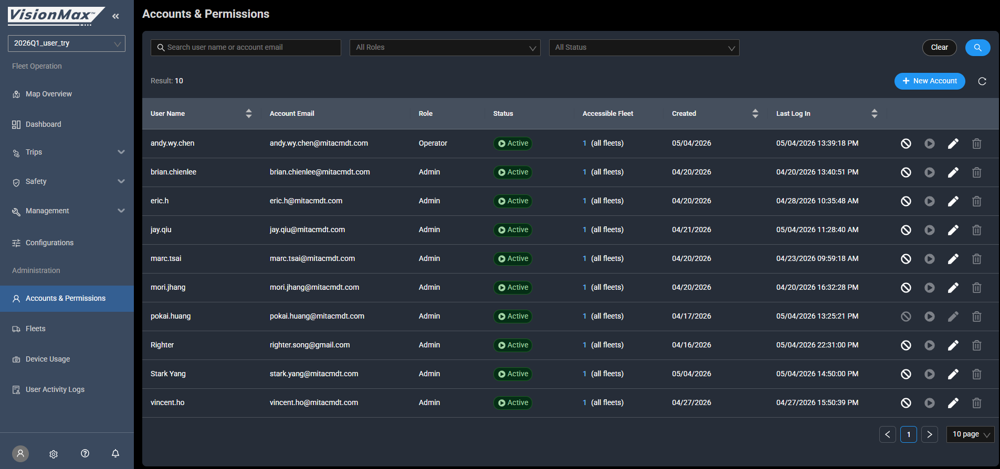

# Portal 雙層架構

> 完整客戶簡報:`../../websiteview/portal-briefing.html`

## 雙層架構

| 層 | URL | 視角 | 使用者 |
|---|-----|------|-------|
| **Master Portal** | `portal.visionmaxfleet.com` | 跨 fleet 設備池總管 | Dealer / 經銷商 / MAU |
| **Fleet Portal** | `www.visionmaxfleet.com` | 單一 fleet 內運營 | Fleet Manager / 客戶 / 內部 PM |

→ 設備 flow:Master Portal 把 CDR **分配 / 開通**給 Fleet → Fleet Portal 運營

## Fleet Portal 19 頁(Kenny 名下測試帳號可登入)

```
2026Q1_user_try (fleet 選擇器)            ← PDF 漏
─────────────
Fleet Operation                            ← PDF 漏(整段)
├─ Map Overview                            ← PDF 漏
├─ Dashboard                               ✅
├─ Trips: List / Detail / Report
├─ Safety: Events / Detail / File Retrieval / Safety Reports / Coaching   ← Coaching PDF 漏
├─ Management: Devices / Drivers / Vehicles / Geofences   ← Drivers/Vehicles PDF 漏
└─ Configurations(5 tabs:Device Settings / Sensor / AI / Road Safety / Safety Score)

Administration                             ← PDF 漏(整段)
├─ Accounts & Permissions
├─ Fleets(2 tabs:Fleets / Contract Fleets)
├─ Device Usage
└─ User Activity Logs
```

## Master Portal 7 頁

```
Master Portal
├─ Dashboard(4 panel:Total Devices / Healthy-Unhealthy / Activated / Total Fleets)
├─ Analysis(Plan Types 折線圖,2 tabs:Assigned Device / Fleets)
├─ Management
│  ├─ Inventory(IMEI / Recalls / 待分配設備)
│  ├─ Diagnostics                          ← PDF 漏
│  ├─ Fleets                               ← PDF 漏(跨 fleet 列表 + New Fleet)
│  └─ User Account                         ← PDF 漏(Admin / Viewer roles)
└─ User Activity Logs                      ← PDF 漏
```

## 📸 Fleet Portal 主要頁面實際截圖

> 從 Kenny 名下測試帳號截圖。對客戶 demo + 內部訓練用。完整 21 張在 `websiteview/VMX_images/Fleet/`。

### Map Overview — 即時車隊地圖

*Fleet Portal 入口頁,所有車輛即時位置 / 軌跡 / events 標示。客戶 demo 開場必用。*

### Dashboard — KPI 儀表板

*Safety Score / Trip count / Distance / Events 統計。Fleet Manager 每天打開的頁。*

### Safety > Events — 事件列表

*所有 ADAS / DMS / G-Sensor 事件清單。**5/6 會議 HDFE 抱怨的就是這頁的 Q1 改版**(點擊次數變多)。*

### Trip List — 行程列表

*依車輛 / 日期 / 駕駛過濾的 trip 紀錄。VMX-7404 ADAS Failure 案件的 trip 7028714 / 7079470 從這找。*

### Configurations > AI Events Detection — AI 事件設定

*Fatigue / Distraction / Phone / Smoking / **Yawning** sub-toggle 的設定頁。**5/6 會議 Yawning 獨立開關 + Lucy UI(VMX-7432)就要加在這頁**。*

### Configurations > Sensor Event Detection — G-Sensor 設定

*Harsh Braking / Cornering / Driving Impact / Parking Impact / Harsh Acceleration / Rollover 6 種事件門檻。**Mori 200Hz G-Sensor 議題 + Rollover detection 都對應這頁**。*

### Management > Devices — 設備管理

*單一 fleet 內所有 K-series 設備清單,App Version / ADAS+DMS Health 顯示。*

### Accounts & Permissions — 帳號權限

*L2 Account 管理(Admin / **Viewer Only** roles)。**5/6 會議 VMX-7088 Viewer Only 角色「detail 能不能看」議題對應這頁**。*

> 完整 21 張其他頁面(Trip Report / Safety Reports / File Retrieval / Drivers / Vehicles / Geofences / Device Usage / User Activity Logs / Configurations 其他 4 tabs / Dashboard II / Fleets tab)在 `websiteview/VMX_images/Fleet/`,需要時直接 reference。

---

## 3-Tier User Model

| L | 在哪管 | 對象 | 權限範圍 |
|---|--------|------|---------|
| L1 | Master > User Account(14 人) | 經銷商員工 | 跨 fleet |
| L2 | Fleet > A&P(8 人) | 單 fleet portal 用戶 | 單一 fleet |
| L3 | Fleet > Drivers(1 人 = Kenny) | 駕駛員(被 RFID 識別) | 不上 portal |

⚠️ **新 Viewer Only 角色**(VMX-7088,2026-05-06 會議討論):不能 Delete / Edit / Download / Retrieve / Configuration — **「detail 能不能看」待釐清**。

## Fleet Portal 三大 Entity

```
Device(車機)── K-series 硬體 / App Version / ADAS+DMS Health
   │
   ├─ via Vehicle Profile binding
   ▼
Vehicle(車輛)── VIN / Year/Make/Model / Vehicle Type
   │
Driver(駕駛)── Employee ID / IC Card S/N / Email
```

## Contract Fleet 真相(PDF 沒寫)

PDF 只承認 2 種商業身分:`Dealer` + `Customer`。

但 **Fleet Portal Admin > Fleets 上有 `Contract Fleets` tab**,且按鈕是 `+ New Account`(不是 + New Contract Fleet)→ 三種解釋:
1. UI 超前 PDF
2. UI 殘留
3. **最可能**:Account-based 模擬(account 跨 fleet 共用,不是真 sub-fleet)

→ ⚠️ **PM 風險**:Sales 用這個灰色地帶銷售,可能簽約後 RD 交不出。

## PDF 漏掉率

- Fleet Portal nav:50% 漏(19 頁中 PDF 列 9)
- Master Portal nav:57% 漏(7 頁中 PDF 列 3)
- 頁面深度(按鍵 / 欄位):>80% 漏
- 整體系統理解:**~70% 沒覆蓋**

→ 「PDF 補強 Wiki ticket」的論據(待跟 Brian 推)。
